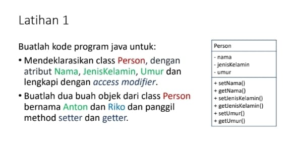

# Tugas Praktikum 3 (Pertemuan ke 4) 

|Nama|NIM|Kelas|Mata Kuliah|
|----|---|-----|------|
|**Radityatama Nugraha**|**312310644**|**TI.23.A6**|**Pemrograman Orientasi Objek**|

# • Mendeklarasikan class Person, dengan atribut Nama, JenisKelamin, Umur dan lengakpi dengan acces modifier

